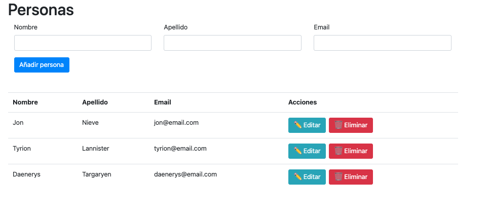

# Person-app

## Descripción aplicación
Aplicación realizada con VUE3 options API. La funcionalidad de la app es crear,editar,modificar y eliminar personas con nombre, apellido y email.

## Lanzar proyecto
1. Instalar los módulos de node
```
yarn install
```
2. Ejecutar app en modo desarrollo
```
yarn serve
```

## Imágenes de la app


